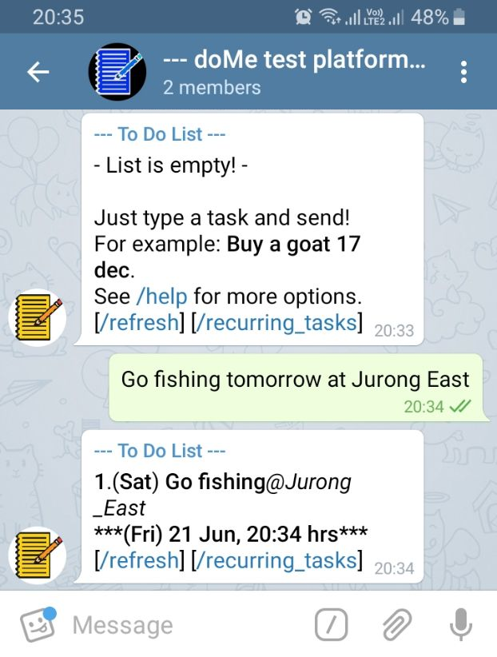

# doMe
No-frills Task Management Telegram Bot

Step 1: Load Telegram API Token
-
Open run.py and edit line below.

    api_token = 'insert_your_api_token_here'

Step 2: Run the Python script
-
    $ python run.py

Step 3: Start recording your tasks!
-

